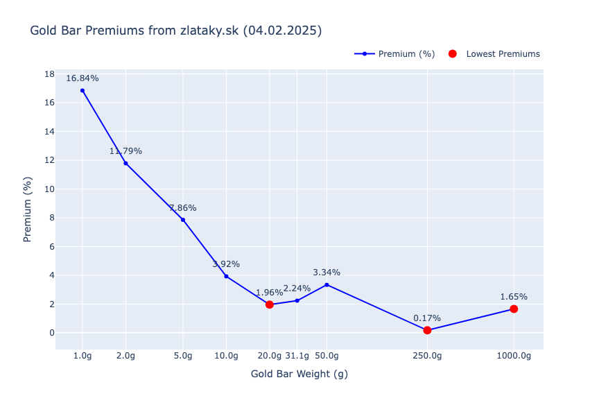

# Gold Price Scraper
This repo started as a simple gold price scraper, that calculates the premiums of gold bars given the current price of gold. However, it has since evolved to include other scripts like expense analysis from expense reports from TatraBanka, or investment projections.

### Setup (mac)
1. `pip install poetry`
2. `poetry install --no-root`


## 1. Gold bar premiums
Scrapes zlataky.sk and plots a graph of the premiums per gold bar size given the current price of gold. A.k.a what should I buy?
The bars are only from Argor Heraeus because I like those for no reason.

### How to run
Run the `main.py` script. No env vars or api keys are needed.

Every time the script is executed, it appends the results to a csv file called `gold_premiums.csv`. From these cumulative data, an average gold premiums are calculated (so you can see if the current price is above or below the average).

I recommend adding a simple cronjob:
```bash
00 16 * * * cd /Users/daskala/Desktop/gold_price_scraper/gold && /Users/daskala/Desktop/gold_price_scraper/.venv/bin/python main.py >> /tmp/main.log 2>&1
```
This runs the script every day at 16:00 and logs the output to `/tmp/main.log`.

Here is a sample output as an image:


The trend is clear, but the variance is quite high as well.

## 2. Expense analysis
Analyzes expenses from TatraBanka, categorizes the items into a set of pre-defined categories (override recommended because everybody's expenses are different) and generates a table of total expenses per category per month with total averages.
To get the data:
1. Open your TatraBanka app or internet banking
2. Click on your card you want to analyse
3. Click on "Pohyby"
4. Top right click the settings icon and select "Exportovať" (as a csv)

Put all your exports into `expenses/expense_reports`, run the `credit_card_expenses.py` script and be shocked by how much you spend on useless stuff.

## 3. Investment projections
After the initial shock from your expenses analysis, you might want to see how much you could have saved if you invested that money instead. The `investing.py` script calculates how much you would have made if you invested that money into a stock market index fund (S&P 500) instead. All parameters can be set in `main.py`.
