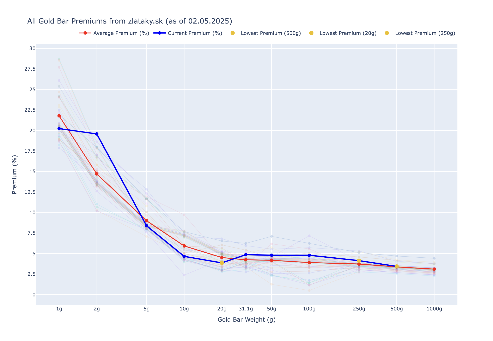

# gold_price_scraper
Scrapes zlataky.sk and plots a graph of the premiums per gold bar size given the current price of gold. A.k.a what should I buy?
The bars are only from Argor Heraeus because I like those.

## How to run (mac)
1. `pip install poetry`
2. `poetry install --no-root`
3. Run the `main.py` script. No env vars or api keys are needed.

Here is a sample output as an image (as of 4.2.2025):

