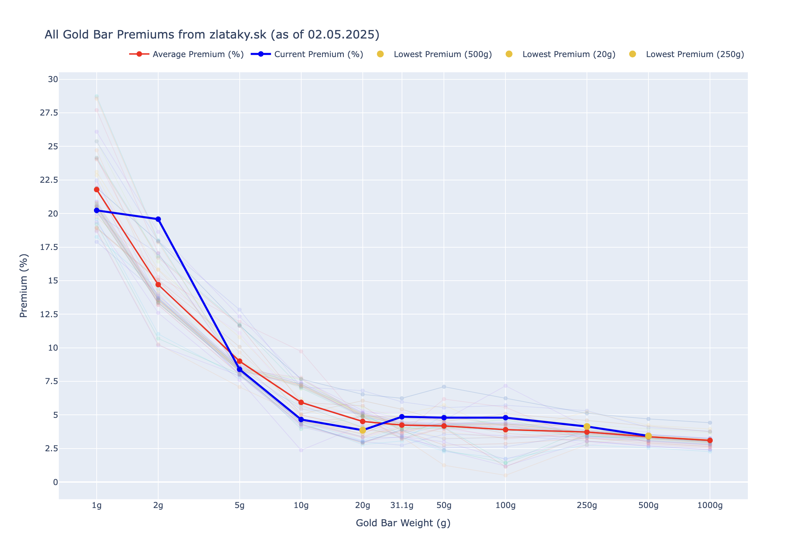

# Gold Bar Premiums

Scrapes [zlataky.sk](https://zlataky.sk) for Argor Heraeus gold bar prices and plots premiums relative to the gold spot price (via yfinance). Tracks history in CSV for trend analysis.

## Usage

```bash
python gold/main.py
```

Each run appends current premiums to `gold_premiums.csv` and displays an interactive Plotly chart showing:
- Historical premium lines (faded) for each past data point
- Average premium line (red)
- Current premium line (blue)
- Top 3 lowest-premium bars highlighted

## Cron

```bash
00 16 * * * cd /path/to/repo/gold && ../.venv/bin/python main.py >> /tmp/gold.log 2>&1
```

## Files

- `main.py` — Scraper + chart generator
- `gold_premiums.csv` — Historical premium data (auto-appended)
- `premiums.png` — Sample chart output


